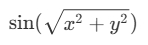

# 3D Plot: $\sin(\sqrt{x^2 + y^2})$

<div align="center">
  
</div>

## Overview

This project visualizes the mathematical expression \( \sin(\sqrt{x^2 + y^2}) \) in a 3D plot. The plot shows how the value of the sine function changes over a grid of `strike price (x)` and `volatility (y)` values, resulting in a 3D surface representing the option price (z). The surface is dynamically animated to rotate for better visualization.

### Formula Represented

The formula represented by the 3D surface plot is:

$\sin(\sqrt{x^2 + y^2})$

Where:
- ```x``` represents the **strike price** of an option.
- ```y``` represents the **volatility** of the underlying asset.
- ```z``` represents the **option price** derived from the formula.

### Purpose

This 3D plot provides a visual understanding of how the option price changes based on the strike price and volatility. It is useful for illustrating the behavior of option prices in a more interactive and intuitive way.

## Features

- **Dynamic Rotation**: The 3D surface plot rotates, providing a 360-degree view of the data, making it easier to analyze the relationship between strike price, volatility, and option price.
- **Mathematical Formula Display**: The plot includes an annotation displaying the formula used to generate the surface, formatted using LaTeX for clarity.

## How to Use

1. Clone or download this repository.
2. Make sure you have the required dependencies installed:
   - ```numpy```
   - ```matplotlib```
3. Run the Python script to visualize the plot:
   
   ```python plot_sin_sqrt.py```

## Code Explanation

The code generates a 3D surface plot using ```matplotlib``` and ```numpy```, where:
- ```x``` and ```y``` are grid values representing the strike price and volatility.
- ```z``` is calculated using the formula \( z = \sin(\sqrt{x^2 + y^2}) \).

### Code Snippet:

```py
import numpy as np
import matplotlib.pyplot as plt
from mpl_toolkits.mplot3d import Axes3D
from matplotlib.animation import FuncAnimation
```

# Sample data
```py
x = np.linspace(-5, 5, 100)
y = np.linspace(-5, 5, 100)
x, y = np.meshgrid(x, y)
z = np.sin(np.sqrt(x**2 + y**2))
```

`# axis`
```py
fig = plt.figure(figsize=(10, 7))
ax = fig.add_subplot(111, projection='3d')
```

`# surface plot`
```py
surf = ax.plot_surface(x, y, z, cmap='viridis', edgecolor='none')
```

# Labels for axes
```py
ax.set_xlabel('Strike Price (X)')`
ax.set_ylabel('Volatility (Y)')`
ax.set_zlabel('Option Price (Z)')
```

# Fixed annotation above the plot (outside of the rotating loop)
```py
strike_price = 2
volatility = 2`
option_price = np.sin(np.sqrt(strike_price**2 + volatility**2))
```

# Annotation at the top of the plot (fixed position)
```py
ax.text2D(0.5, 0.95, r'$\sin(\sqrt{x^2 + y^2})$',`
`ha='center', va='top', color='red', fontsize=12, transform=ax.transAxes)
```

`# Function to update the plot for each frame (for rotation)`
```py
def update(frame):
    ax.view_init(elev=30, azim=frame)  # view angle for rotation
    return surf,
    ```

# animation
```py
ani = FuncAnimation(fig, update, frames=np.arange(0, 360, 2), interval=100, blit=False)
```

# Display the plot interactively
```py
plt.show()
```

### Dependencies:

- **NumPy**: Used for numerical operations and meshgrid creation.
- **Matplotlib**: Used for plotting the 3D surface and animation.
- **FuncAnimation**: Provides the rotation effect for the plot.

## Example Output

The output is a 3D rotating surface plot, with axes labeled as:
- **Strike Price (X)**
- **Volatility (Y)**
- **Option Price (Z)**

Additionally, the formula ```sin(sqrt(x^2 + y^2))``` is displayed at the top of the plot.

## Future Improvements

- Add more complex models and additional surface plots for comparison.
- Incorporate user input to customize the plot's parameters (e.g., range for strike price and volatility).
